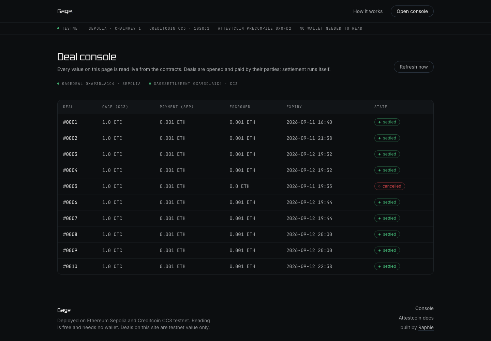
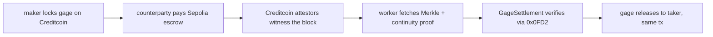
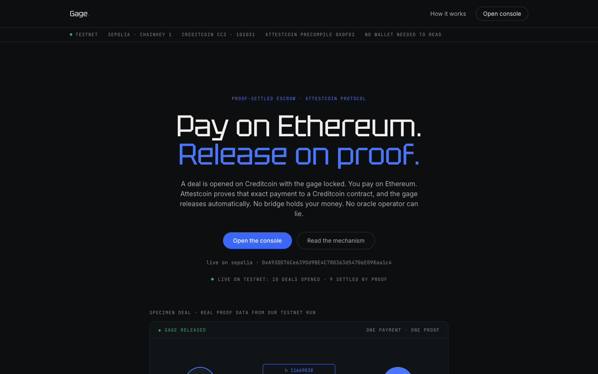

# Gage · proof-settled escrow

A cross-chain deal settles when an Attestcoin proof of the payment lands on Creditcoin: the maker locks a gage, the counterparty pays on Ethereum, and the proof of that exact transaction releases the gage. No bridge holds the money. No oracle operator can lie. Anyone can submit the proof.

**Live: [gage-omega.vercel.app](https://gage-omega.vercel.app) · Console: [gage-omega.vercel.app/console](https://gage-omega.vercel.app/console) · Demo video: [final-v2.mp4](https://github.com/A-Raphie/gage/blob/main/demo-take/final-v2.mp4) · Build post: [x.com/A_raphie](https://x.com/A_raphie/status/2098875502912028893)**



## Judge path (90 seconds)

1. Open the [console](https://gage-omega.vercel.app/console) · every number is a live RPC read from the contracts, no wallet needed.
2. Click deal #0010 · terms, the proof strand, and the settled state.
3. Verify on explorers · links are on every deal row and below in the proof table.

## Proof table

Ten deals were opened, paid, and settled on testnet during the build. Receipts, newest first:

| # | action | what it proves | tx |
|---|--------|----------------|----|
| 10 | settle deal 10 | full loop, fresh run: register, lock, pay, auto-settle ~8 min later | [`0xe9f9ccb3…`](https://creditcoin-testnet.blockscout.com/tx/0xe9f9ccb3314d9f82870b98f6fd03a3c6109461e6bb1929ddb6d8b47036b39eb3) |
| 8+9 | `settleMany` | batch: 2 payments proved and released in ONE Creditcoin transaction | [`0xf0826186…`](https://creditcoin-testnet.blockscout.com/tx/0xf08261865069fcfc101c84e513c42998fd55989c0c93e980d918e0a72d314e10) |
| 7 | settle deal 7 | single-payment settle by the cron worker | [`0x21ee4f41…`](https://creditcoin-testnet.blockscout.com/tx/0x21ee4f416a6ec18f13f8867a40e6a2854b2982363a6aeba26d3fda4a7eaef944) |
| 5 | `cancelExpired` | expired deal: maker refunded the 1 CTC gage on-chain | [`0xb27e863c…`](https://creditcoin-testnet.blockscout.com/tx/0xb27e863ca76feff9dbdbc70d6818179dd41eb1e5370bb871baccdbdb720190ec) |
| 4 | settle deal 4 | settlement with amount + ref matched from proved bytes | [`0x1829c00e…`](https://creditcoin-testnet.blockscout.com/tx/0x1829c00e7197021bf74e3361e5d37a9de9fab24870b0ef9fe610b5bade5ef83d) |
| 3 | settle deal 3 | same | [`0x467a849f…`](https://creditcoin-testnet.blockscout.com/tx/0x467a849f80214c542c9dcbc5d5d13c94e03ca601b376b827aa43b24b1bd67fbf) |
| 2 | settle deal 2 | same | [`0x17507bf3…`](https://creditcoin-testnet.blockscout.com/tx/0x17507bf34467fb132254c37e8d3ff725f8d8ffd6953fa47b22c79fc15e10b592) |
| 1 | settle deal 1 | first full loop | [`0xcee34f5c…`](https://creditcoin-testnet.blockscout.com/tx/0xcee34f5caa975eae9da2c88bb998736265ecd0bd5dedd22f2f85b9445335707d) |

Source-side payments (Ethereum Sepolia), examples: deal 10 payment [`0xaae0e93e…`](https://sepolia.etherscan.io/tx/0xaae0e93e2242042bad7688cdf878572ef8f7f5035beaedb1e999d0e680575665), deal 1 payment [`0x9b192a08…`](https://sepolia.etherscan.io/tx/0x9b192a082d633dcdaeaf759f88124b90c1d5383561cead2d345830313043880f).

## Contracts

| contract | chain | address | explorer |
|---|---|---|---|
| GageDeal (source escrow) | Ethereum Sepolia (11155111) | [`0xA93DD76Ce639Dd9BE4C780363d54706E098aa1c4`](https://sepolia.etherscan.io/address/0xA93DD76Ce639Dd9BE4C780363d54706E098aa1c4) | Etherscan · Sourcify-verified |
| GageSettlement (ASC on Creditcoin) | Creditcoin CC3 testnet (102031) | [`0xA93DD76Ce639Dd9BE4C780363d54706E098aa1c4`](https://creditcoin-testnet.blockscout.com/address/0xA93DD76Ce639Dd9BE4C780363d54706E098aa1c4) | Blockscout |

Same address on both chains: CREATE from a nonce-0 deployer lands identically. RPC: `https://rpc.cc3-testnet.creditcoin.network` · proof builder: `https://prover.cc3-testnet.creditcoin.network` · Attestcoin verifier precompile: `0x0FD2`.

## Honesty table

| what is real | what is operator-run or limited |
|---|---|
| Contracts deployed, source-verified, live on both testnets | Testnet value only; nothing here touches mainnet |
| 10 deals, 8 settlements, 1 batch settle, 1 expiry refund, all on-chain | Deals in the demo runs were opened and paid by the operator's wallet; the contracts are counterparty-agnostic but no stranger has traded yet |
| Settlement is permissionless: `settle` / `settleMany` have no access control, proof dedupe is on-chain | The submitting worker runs on GitHub Actions cron; anyone can run their own, ours is just the one doing it |
| Attestation is Creditcoin's decentralized attestor set, not our infrastructure | Payer reclaim (3-day window) is code-verified but has not lapsed live |
| Console reads are direct RPC, no mocks, no wallet needed | Deal creation is CLI-first (`cast`); the web surface is read-and-verify by design |
| Writability (Creditcoin to other chains) is a protocol feature still in audit upstream | |

## How it works



The core integration is the Attestcoin readability flow: the Sepolia escrow emits one unambiguous event (`PaymentMade(dealId, payer, amount, ref)`); the proof of that exact transaction is verified synchronously by the native query verifier precompile; the ASC decodes the proved bytes and matches them against the deal terms before releasing.

```solidity
// GageSettlement: dedupe, verify, decode, release (simplified)
bytes32 queryId = _computeQueryId(chainKey, height, merkleRoot, siblings);
require(!processedQueries[queryId]) // replay-proof
require(_verifyProof(chainKey, height, txBytes, merkleProof, continuity)) // precompile 0x0FD2
processedQueries[queryId] = true;
_releaseFromLog(decodedLogs[0], queryId) // amount + ref must match the deal terms
```

Deal terms live on the Creditcoin side where the value is locked: taker, expiry, expected payment amount, expected reference, and the one authorized source-chain emitter. Refunds are self-executable on both sides (maker after expiry, payer after a 3-day window).

## The app

The [console](https://gage-omega.vercel.app/console) is the read surface: the deals table, per-deal proof strand (payment token on the Ethereum side, release token on Creditcoin, the strand carries the live proof height and snaps solid at verification), and explorer links. Reading is free and needs no wallet.



## Stack · Run locally

- Contracts: Foundry, Solidity 0.8.28, [`@gluwa/asc-contracts`](https://www.npmjs.com/package/@gluwa/asc-contracts) (ASCBase + EvmV1Decoder)
- Worker: TypeScript, [`@gluwa/usc-sdk`](https://www.npmjs.com/package/@gluwa/usc-sdk) + ethers v6 · hosted on GitHub Actions cron (every 5 minutes, `RUN_ONCE`)
- Web: Next.js 16 + Tailwind 4 on Vercel

```bash
# contracts
cd contracts && forge build && forge test
# deploy (CC3 rejects forge script's prevrandao: use raw create)
cast send --private-key $PK --rpc-url $CC3_RPC --create "$(jq -r .bytecode.object out/GageSettlement.sol/GageSettlement.json)"

# worker (one pass)
cd worker && cp ../.env.example .env && npm install
GAGE_DEAL_ADDRESS=0xA93D... GAGE_SETTLEMENT_ADDRESS=0xA93D... RUN_ONCE=1 npx tsx index.ts

# web
cd web && bun install && bun run build && bun run start
```

`.env.example` files: root, `worker/`, `web/` · required keys are the RPCs, a funded CC3 key, and the two contract addresses.

## Project structure

```
contracts/   Foundry: GageDeal (Sepolia) + GageSettlement (CC3 ASC)
worker/      event watcher: attestation wait, proof fetch, settle / settleMany
web/         Next.js: landing + live console (the proof strand lives here)
docs/media/  screenshots
```

## Links

- Live app: https://gage-omega.vercel.app
- Attestcoin docs: https://docs.attestcoin.org/
- Hackathon: BUIDL CTC 2026 Fall on DoraHacks
- Built by [Raphie](https://x.com/a_raphie)

## License

MIT
